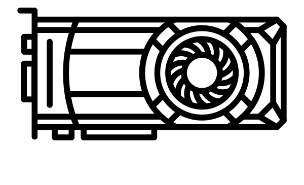
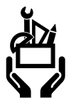

<!-- _class: lead -->
<style>
  :root {
    --color-foreground: #333e63 !important;
    --color-highlight: #d17930 !important;
    --color-dimmed: #888 !important;
  }
h1 {
    font-size: 1.6em;
}
h2 {
    font-size: 1.2em;
}
h3 {
    font-size: 1.0em;
}
h4 {
    font-size: 0.8em;
    color: #888;
}
p, li {
    font-size: 0.7em;
}
.attributions {
    position:absolute;
    bottom:5px;
    right:10px;
    font-size: 0.4em;
    color: grey;
    text-align: right;
}


@keyframes changeColor {
    from {
        color: #333e63;
    }
    to {
        color: #d17930;
    }
}

.brian {
    animation: changeColor 2s ease-in-out infinite alternate;
}

.two-columns {
    columns: 2 auto;
    column-gap: 5%;
}
</style>
<h1>Simulating spiking neural networks with <br><span class="brian">Brian 2</span></h1>

<p></p>

## CNS*2021 showcase


<h3><i>Marcel Stimberg</i></h3>
<h4>(Institut de la Vision/Sorbonne Université)</h4>

July 3rd 2021

---

## Brian’s history
<!-- _class: hbox -->


<div class="container" style="display: flex;">
<div class="flex-col" style="width: 50%;" data-markdown>


Dan Goodman
(Imperial College London)

</div>
<div class="flex-col" style="width: 50%;" data-markdown align="right">


Romain Brette
(Institut de la Vision)

</div>
</div>

- Started in **2007** at ENS Paris by Romain and Dan

- Widely used for **research and teaching**

> A simulator should not only save the time of processors, but also the time of scientists

- No built-in library, tools to describe **"any" model**

- Big rewrite in 2014 (**code generation**)

- **Free-and-open-source** since the start

---

## Brian’s philosophy


* Use the same language to describe models that
  we use in scientific publications: **equations**
* Built-in system for **physical units**
  Dimensional quantities are used everywhere,
  consistency is checked/enforced
  ```pycon
  >>> Cm = 200*pF; Rm = 100*Mohm
  >>> tau = Cm * Rm
  >>> print(tau)
  20. ms
  ```
* Written in **Python** and making best use of it
  (overwritten operators for unit system,
   indexing, helpful error messages...)
* Friendly **community**, extensive **documentation**
  and helpful forums :smiley_cat:
  
<div class="attributions" style="text-align: left;">
Paper on the left:<br>
Peron et al. Recurrent interactions in local cortical circuits. Nature (2020)
<a href="https://doi.org/10.1038/s41586-020-2062-x">10.1038/s41586-020-2062-x</a>
</div>

---

## Brian’s technology:<br> code generation


**Brian code**
```Python
group = NeuronGroup(1, 'dv/dt = -v / tau : 1')
```

**"Abstract code" (internal pseudo-code representation)**
```Python
_v = v*exp(-dt/tau)
v = _v
```

---

## Brian’s technology:<br> code generation


**C++ code snippet (once-per-group code)**
```C++
const double _lio_1 = exp((-dt)/tau);
```

**C++ code snippet (once-per-neuron code)**
```C++
double v = _ptr_array_neurongroup_v[_idx];
const double _v = _lio_1*v;
v = _v;
_ptr_array_neurongroup_v[_idx] = v;
```

---

## Brian’s technology:<br> code generation


**Final C++ code after insertion in template**
```C++
const double _lio_1 = exp((-dt)/tau);
for(int _idx=0; _idx<_N; idx++)
{
    double v = _ptr_array_neurongroup_v[_idx];
    const double _v = _lio_1*v;
    v = _v;
    _ptr_array_neurongroup_v[_idx] = v;
}
```

---

## Brian’s technology:<br> execution modes


* **Runtime mode**
  Simulation loop runs in **Python**, calls compiled blocks to do the work
  :+1: Very flexible, can be combined with **arbitrary Python code**
  :-1: **Overhead** from running Python, especially for small networks

* **Standalone mode**
  Everything (models + connection definitions, initializations)
  written out to a **standalone C++ project**
  Compiled binary executes full run and stores results to disk
  :+1: **Fast**, no Python overhead
  :+1: Can be **tailored** to other platforms
  :-1: **Less flexible**, no Python interaction during run
---


## Brian’s domain


- **integrate-and-fire** models
  $$C_m dv/dt = g_L(E_L - v) + I$$
  If $v > v_{th}$: emit spike and set $v \leftarrow v_{reset}$
- non-linear channel dynamics (e.g. **Hodgkin-Huxley**)
  $$
  C_m dv/dt = (g_L\left(E_L - v\right) + m^3 n g_{Na}\left(E_{Na} - v\right) + n^4\left(E_K - v\right)\\
  dm/dt = \dots
  $$
- **multi-compartmental** models
  (complex morphologies not yet very convenient to use)
  <div align="center">
  
  </div>
---

## Brian’s speed


<p style="font-size: 0.45em;">
“CUBA” network (sparsely connected LIF neurons;  synapses = exponential currents)
</p>


<div class="attributions" style="text-align: left;">
<a href="https://doi.org/10.7554/eLife.47314.011">Stimberg, Brette, Goodman, <i>Brian 2, an intuitive and efficient neural simulator</i>, eLife 2019;8:e47314</a>
</div>

---

## Example 1: neuron models

Integrate-and-fire model with **noisy adaptive threshold**


```Python
g_L = 10*nS; E_L = -70*mV; C_m = 200*pF
vt_0 = -50*mV; vt_adapt = 10*mV; tau_vt = 50*ms; sigma_vt = 5*mV
neurons = NeuronGroup(4, model="""
                     dv/dt = (g_L*(E_L - v) + I_inj)/C_m: volt
                     dvt/dt = (vt_0 - vt)/tau_vt + sigma_vt*tau_vt**-0.5*xi : volt
                     I_inj : amp (constant)""",
                     threshold='v > vt', reset='''v = E_L
                                                  vt += vt_adapt''')
```

<div class="attributions" style="text-align: left;">
<a href="https://github.com/brian-team/brian-material/blob/master/2021-07-CNS-showcase/code/example_1.py">Full example code</a>
</div>

---

## Example 2: synapse models

### short-term synaptic plasticity
(Tsodyks, Pawelzik, Markram, *Neural Computation*, 1998)


```Python
U_SE = 0.6    # utilization of synaptic efficacy
w_max = 2*nS  # maximal synaptic conductance
synapses_eqs = '''dx/dt = z / tau_rec          : 1 (event-driven) # "recovered"
                  dy/dt = -y / tau_in          : 1 (event-driven) # "effective"
                  dz/dt = y/tau_in - z/tau_rec : 1 (event-driven) # "inactive"
                  tau_rec : second (constant)
                  tau_in : second (constant)'''
synapses_action = '''y += U_SE * x
                     x -= U_SE * x
                     g_post += w_max * x'''
syn = Synapses(spike_source, target_neurons, model=synapses_eqs,
               on_pre=synapses_action)
```

<div class="attributions" style="text-align: left;">
<a href="https://github.com/brian-team/brian-material/blob/master/2021-07-CNS-showcase/code/example_2.py">Full example code</a>
</div>

---

## Example 3: synaptic connections

- Expressive **connection syntax**
- arbitrary **labels/properties** in models<br> → **descriptive** connection declaration 

```Python
neuron = NeuronGroup(100, model="""# ... actual neuron model
                     neuron_type : integer (constant)
                     x : meter (constant)
                     y : meter (constant)""")
neuron.neuron_type = 'int(rand() * 2)'  # two types
neuron.x = '(i % 10) * 50*um'  # Neurons arranged in a grid
neuron.y = '(i // 10) * 50*um'

synapses = Synapses(neuron, neuron)  # do-nothing synapse just for illustration
synapses.connect('neuron_type_pre == neuron_type_post',  # only if same type
                 p='1.5*exp(-sqrt(((x_pre - x_post)**2 +'
                   '               (y_pre - y_post)**2))/(100*um))')
```


<div class="attributions" style="text-align: left;">
<a href="https://github.com/brian-team/brian-material/blob/master/2021-07-CNS-showcase/code/example_3.py">Full example code</a>
</div>

---

## Example 4: stimulus protocols

- Flexible description of e.g. **stimuli**
- parameters can **change over time**

```Python
g_L = 10*nS; E_L = -70*mV; C_m = 200*pF
neuron = NeuronGroup(3, model="""
                     dv/dt = (g_L*(E_L - v) + I_inj)/C_m : volt
                     I_inj = amplitude * (0.5 + 0.5 * sin(2*pi*freq*t)) : amp
                     amplitude : amp
                     freq : Hz""",
                     threshold='v > -40*mV', reset='v = E_L')
neuron.run_regularly("""amplitude = rand() * 2*nA
                        freq = 50*Hz + 100*Hz*rand()""",
                     dt=100*ms)  # change injected current every 100ms
```


<div class="attributions" style="text-align: left;">
<a href="https://github.com/brian-team/brian-material/blob/master/2021-07-CNS-showcase/code/example_4.py">Full example code</a>
</div>

---

## The world of Brian
<!-- _class: hbox -->
<div class="container" style="display: flex;">
<div class="flex-col" style="width: 50%;" data-markdown>



**Brian2GeNN** (code generation for GeNN)
[brian2genn.readthedocs.io](https://brian2genn.readthedocs.io/)
With: *Thomas Nowotny*

**Brian2CUDA** (code generation for CUDA)
[github.com/brian-team/brian2cuda/](https://github.com/brian-team/brian2cuda/)  :construction:
*Denis Alevi, Moritz Augustin*
</div>
<div class="flex-col" style="width: 50%;" data-markdown>



**brian2tools**
(visualization, NeuroML import/export)
[brian2tools.readthedocs.io](https://brian2tools.readthedocs.io/)
With: *Vigneswaran C, Kapil Kumar, Dominik&nbsp;Krzemiński*

**brian2modelfitting**
(fitting models to experimental data)
[brian2modelfitting.readthedocs.io](https://brian2modelfitting.readthedocs.io/)
With: *Romain Brette, Aleksandra Teska, Ante&nbsp;Lojić&nbsp;Kapetanović (current GSoC student)*
</div> </div>
<div class="attributions">
GPU drawing by Misha Petrishchev from the Noun Project<br>
Toolbox drawing by <a href="https://commons.wikimedia.org/wiki/File:Tool_box_icon-01.svg">MCruz (WMF)</a>, <a href="https://creativecommons.org/licenses/by-sa/4.0">CC BY-SA 4.0</a>, via Wikimedia Commons</div>

---

### Brian2GeNN 

Interface to the [GeNN simulator](https://genn-team.github.io/genn/) (see previous show case)

```Python
from brian2 import *
# ↓ ↓ ↓
import brian2genn
set_device('genn')
# ↑ ↑ ↑ 
N = 10000
tau = 10*ms
Iin = 0.11/ms 
eqs = 'dV/dt = -V/tau + Iin : 1'
G = NeuronGroup(N, eqs, threshold='V>1', reset='V=0', refractory=5 * ms)

run(10*ms)
```
<div class="attributions">
Thomas Nowotny, James Knight<br>
<a href="https://github.com/brian-team/brian2genn">github.com/brian-team/brian2genn</a>
</div>

---

### Brian2CUDA 

Direct code generation for CUDA :construction: (release soon!)

```Python
from brian2 import *
# ↓ ↓ ↓
import brian2cuda
set_device('cuda')
# ↑ ↑ ↑ 
N = 10000
tau = 10*ms
Iin = 0.11/ms 
eqs = 'dV/dt = -V/tau + Iin : 1'
G = NeuronGroup(N, eqs, threshold='V>1', reset='V=0', refractory=5 * ms)

run(10*ms)
```

<div class="attributions">
Denis Alevi, Moritz Augustin<br>
<a href="https://github.com/brian-team/brian2cuda">github.com/brian-team/brian2cuda</a>
</div>

---

### Brian2tools 

### Simple plotting tools


```Python
from brian2 import ...
# Setup network

from brian2tools import brian_plot
brian_plot(state_monitor)
```


```Python
brian_plot(synapses)
```

---

### Brian2tools 

### import/export framework
```Python
v0 = 11*mV; tau = 10*ms
eqs = 'dv/dt = (v0 - v) / tau : volt (unless refractory)'
group = NeuronGroup(n, eqs, threshold='v > 10*mV', reset='v = 0*mV',
                    refractory=5*ms, method='exact', name='excitatory')
```

<div class="two-columns">

#### NeuroML
```xml
<?xml version="1.0" ?>
<Lems xmlns="http://www.neuroml.org/lems/0.7.3" 
      …>
…
      <Regime initial="true" name="integrating">
        <TimeDerivative value="(v0 - v) / tau" variable="v"/>
        <OnCondition test="v .gt. (10 * mV)">
…
```
<br><br>

#### Text-based descriptions

**Neuron population :**
- Group **excitatory**, consisting of **10** neurons.

	**Model dynamics:**

	$\frac{d}{d t} v$=$\frac{- v + v_{0}}{\tau}$, except during the refractory period.
…

</div>

(Included in next release :construction:)

<div class="attributions">
Vigneswaran C, Kapil Kumar, Dominik Krzemiński
<a href="https://brian2tools.readthedocs.io">brian2tools.readthedocs.io</a>
</div>

---


### Brian2modelfitting 

**Easy-to-use fitting framework for Brian**

- Model definitions in Brian syntax
- global gradient-free methods (via *Nevergrad*)
- local gradient-based methods (via *lmfit*/*scipy*)
- flexible and modular (e.g. replaceable error metrics)

**Simulation-based inference**

- estimate posterior distribution of parameters
- Wrapper around *sbi* package
- Work-in-progress (GSoC) :construction:

#### Poster: [P131](https://cns2021online.sched.com/event/kEdc/p131-fitting-neural-models-to-experimental-data-with-brian-2) (Monday 3pm EDT / 9pm CEST) <!--fit-->

<div class="attributions">
Romain Brette, Aleksandra Teska, Ante&nbsp;Lojić&nbsp;Kapetanović<br>
<a href="brian2modelfitting.readthedocs.io">brian2modelfitting.readthedocs.io</a>
</div>

---


## Brian user survey

For Brian users and everyone who might become one – please fill out this (very short) survey:

### [tinyurl.com/brian-survey-2021](https://tinyurl.com/brian-survey-2021) <!--fit-->

Thanks :yellow_heart:!

---

## Where to learn more about Brian

&nbsp; Website: [briansimulator.org](https://briansimulator.org)

&nbsp; Documentation: [brian2.readthedocs.io](https://brian2.readthedocs.io)


&nbsp; Discussion forum: [brian.discourse.group](https://brian.discourse.group)

&nbsp; Development repository: [github.com/brian-team/brian2](https://github.com/brian-team/brian2)

&nbsp; Twitter account: [@briansimulator](https://twitter.com/briansimulator)


<div style='font-size: 0.6em'>
<p>Stimberg, M., Brette, R., & Goodman, D. F. (2019). Brian 2, an intuitive and efficient neural simulator. ELife, 8, e47314. <a href="https://doi.org/10.7554/eLife.47314">10.7554/eLife.47314</a></p>

<p>Stimberg, M., Goodman, D. F. M., Brette, R., & Pittà, M. D. (2019). Modeling Neuron–Glia Interactions with the Brian 2 Simulator. In M. De Pittà & H. Berry (Eds.), Computational Glioscience (pp. 471–505). Springer International Publishing. <a href="https://doi.org/10.1007/978-3-030-00817-8_18">10.1007/978-3-030-00817-8_18</a></p>

<p>Stimberg, M., Goodman, D. F. M., Benichoux, V., & Brette, R. (2014). Equation-oriented specification of neural models for simulations. Frontiers in Neuroinformatics, 8. <a href="https://doi.org/10.3389/fninf.2014.00006">10.3389/fninf.2014.00006</a></p>
</div>

