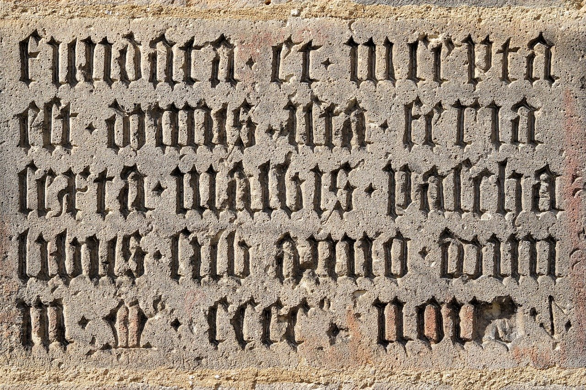

<!-- _class: lead -->

<style>
  :root {
    --color-foreground: #333e63 !important;
    --color-highlight: #d17930 !important;
    --color-dimmed: #888 !important;
  }
h2 {
    font-size: 1.25em;
}
h3 {
    font-size: 1.0em;
}
h4 {
    font-size: 0.8em;
    color: #888;
}
p, li {
    font-size: 0.7em;
}
.attributions {
    position:absolute;
    bottom:5px;
    right:10px;
    font-size: 0.4em;
    color: grey;
    text-align: right;
}

.highlighted-line {
  background-color: #14161a;
  display: block;
  margin: 0 -1.575rem;
  padding: 0 1.575rem;
}

table, tr, td {
    border: none !important;
}


@keyframes changeColor {
    from {
        color: #333e63;
    }
    to {
        color: #d17930;
    }
}

.brian {
    animation: changeColor 1.5s ease-in-out infinite alternate;
}
</style>

<h1>The <span class="brian">Brian</span> simulator</h1>

## NeurotechEU autumn school

<h3>Marcel Stimberg</h3>
<h4><i>Research Engineer, Brian lead developer</i><br>
(ISIR/Sorbonne Université)</h4>

Oct 19th 2023

---

## Brian's history

<!-- _class: hbox -->



<div class="container" style="display: flex;">
<div class="flex-col" style="width: 50%;" data-markdown>


Dan Goodman
(Imperial College London)

</div>
<div class="flex-col" style="width: 50%;" data-markdown align="right">


Romain Brette
(ISIR, Sorbonne Université)

</div>
</div>

- Started in **2007** at ENS Paris by Romain and Dan

- Widely used for **research and teaching**

> Defining new neural models should be no more difficult than writing down their equations

- No built-in library, tools to describe **"any" model**

- Big rewrite in 2014 (**code generation**)

- **Free-and-open-source** since the start

---

## Brian's philosophy


* Use the same language to describe models that
  we use in scientific publications: **equations**
* Built-in system for **physical units**
  Dimensional quantities are used everywhere,
  consistency is checked/enforced
  
  ```pycon
  >>> Cm = 200*pF; Rm = 100*Mohm
  >>> tau = Cm * Rm
  >>> print(tau)
  20. ms
  ```
* Written in **Python** and making best use of it
  (overwritten operators for unit system,
   indexing, helpful error messages...)
* Friendly **community**, extensive **documentation**
  and helpful forums :smiley_cat:

<div class="attributions" style="text-align: left;">
Paper on the left:<br>
Peron et al. Recurrent interactions in local cortical circuits. Nature (2020)
<a href="https://doi.org/10.1038/s41586-020-2062-x">10.1038/s41586-020-2062-x</a>
</div>

---

## Brian's technology:<br> code generation

(code simplified for clarity)


**Brian code**

```Python
group = NeuronGroup(1, 'dv/dt = -v / tau : 1')
```

**"Abstract code" (internal pseudo-code representation)**

```Python
v_new = v*exp(-dt/tau)
```

---

## Brian's technology:<br> code generation


**C++ code snippet (once-per-group code)**

```C++
const double value_1 = exp(-dt/tau);
```

**C++ code snippet (once-per-neuron code)**

```C++
double v = neurongroup_v[_idx];
const double v_new = value_1*v;
neurongroup_v[_idx] = v_new;
```

---

## Brian's technology:<br> code generation


**Final C++ code after insertion in template**

```C++
const double value_1 = exp(-dt/tau);

for(int _idx=0; _idx<_N; idx++)
{
  double v = neurongroup_v[_idx];
  const double v_new = value_1*v;
  neurongroup_v[_idx] = v_new;
}
```

---

## Brian's technology:<br> execution modes


* **Runtime mode**
  Simulation loop runs in **Python**, calls compiled blocks to do the work
  :+1: Very flexible, can be combined with **arbitrary Python code**
  :-1: **Overhead** from running Python, especially for small networks

* **Standalone mode**
  Everything (models + connection definitions, initializations)
  written out to a **standalone C++ project**
  Compiled binary executes full run and stores results to disk
  :+1: **Fast**, no Python overhead
  :+1: Can be **tailored** to other platforms
  :-1: **Less flexible**, no Python interaction during run

---

## Brian's domain


- **integrate-and-fire** models
  $$C_m dv/dt = g_L(E_L - v) + I$$
  If $v > v_{th}$: emit spike and set $v \leftarrow v_{reset}$
- non-linear channel dynamics (e.g. **Hodgkin-Huxley**)
  
  $$
  C_m dv/dt = (g_L\left(E_L - v\right) + m^3 n g_{Na}\left(E_{Na} - v\right) + n^4\left(E_K - v\right)\\
dm/dt = \dots
  $$
- **multi-compartmental** models
  (complex morphologies not yet very convenient to use)
  
  <div align="center">
  
  </div>

---

## Interactive jupyter notebook tutorial

We will discuss the following examples:

- Generating the f/I curve of a *leaky integrate-and-fire neuron*
  [Example: IF_curve_LIF &mdash; Brian 2 documentation](https://brian2.readthedocs.io/en/stable/examples/IF_curve_LIF.html)

- Simulating a sparsely connected *random network*
  [Example: CUBA &mdash; Brian 2 documentation](https://brian2.readthedocs.io/en/stable/examples/CUBA.html)

- Modelling synapses with *spike-timing-dependent plasticity*
  [Example: STDP &mdash; Brian 2 documentation](https://brian2.readthedocs.io/en/stable/examples/synapses.STDP.html)

## 

---

## Example: neuron model

### Leaky integrate-and-fire neuron with stimulus current

$$
C\frac{dV}{dt} = I_\mathrm{stim} + g_L(V_\mathrm{rest}-V)
$$
If $V(t) > V_\mathrm{threshold}$ → emit spike and set $V(t) = V_\mathrm{reset}$


```python
N_neurons = 100
C = 200*pF
g_L = 10*nS
V_rest = -70*mV
V_threshold = -50*mV
V_reset = V_rest
eqs = 'dV/dt = (I_stim + g_L*(V_rest - V)) / C : volt'
group = NeuronGroup(N_neurons, eqs,
                    threshold='V > V_threshold', reset='V = V_reset')
```

---

## Example: synapse model

### current-based synapse (simple exponential)

- In between spikes: $\frac{dI_\mathrm{syn}}{dt} = \frac{-I_\mathrm{syn}}{\tau_\mathrm{syn}}$
- when a spike arrives, increase $I_\mathrm{syn}$ by 0.1 nA

```python
eqs = '''dV/dt = (I_syn + g_L*(V_rest - V)) / C : volt
         dI_syn/dt = -I_syn/tau_syn : amp'''
group = NeuronGroup(N_neurons, eqs,
                    threshold='V > V_threshold', reset='V = V_reset')
synapses = Synapses(…, neurons, on_pre='I_syn += 0.1*nA')
synapses.connect(…)
```

---

## Example: synaptic plasticity

### Spike-timing dependent plasticity

<div align="center"  style='height: 70%;'>

</div>

<div class="attributions" style="text-align: left;">
Bi and Poo. Synaptic Modifications in Cultured Hippocampal Neurons: […]. J Neurosci (1998)
<a href="https://doi.org/10.1523/JNEUROSCI.18-24-10464">10.1523/JNEUROSCI.18-24-10464</a>
</div>

---

## Example: synaptic plasticity

### Online implementation

<div align="center"  style='height: 70%;'>

</div>

<div class="attributions" style="text-align: left;">
Morrison et al. Phenomenological models of synaptic plasticity based on spike timing. Biol Cybern (2008)
<a href="https://doi.org/10.1007/s00422-008-0233-1">10.1007/s00422-008-0233-1</a>
</div>

---

## Showcase example 1

### Synaptic connections

- Expressive **connection syntax**
- arbitrary **labels/properties** in models<br> → **descriptive** connection declaration 

```Python
neuron = NeuronGroup(100, model="""# ... actual neuron model
                     neuron_type : integer (constant)
                     x : meter (constant)
                     y : meter (constant)""")
neuron.neuron_type = 'int(rand() * 2)'  # two types
neuron.x = '(i % 10) * 50*um'  # Neurons arranged in a grid
neuron.y = '(i // 10) * 50*um'

synapses = Synapses(neuron, neuron)  # do-nothing synapse just for illustration
synapses.connect('neuron_type_pre == neuron_type_post',  # only if same type
                 # Probability = negative exponential of distance
                 p='1.5*exp(-sqrt(((x_pre - x_post)**2 +'
                   '               (y_pre - y_post)**2))/(100*um))')
```


<div class="attributions" style="text-align: left;">
<a href="https://github.com/brian-team/brian-material/blob/master/2023-10-NeurotechEU-autumn-school/code/example_3.py">Full example code</a>
</div>

---

## Showcase example 2
### Stimulus protocols

- Flexible description of e.g. **stimuli**
- parameters can **change over time**

```Python
g_L = 10*nS; E_L = -70*mV; C_m = 200*pF
neuron = NeuronGroup(3, model="""
                     dv/dt = (g_L*(E_L - v) + I_inj)/C_m : volt
                     I_inj = amplitude * (0.5 + 0.5 * sin(2*pi*freq*t)) : amp
                     amplitude : amp
                     freq : Hz""",
                     threshold='v > -40*mV', reset='v = E_L')
neuron.run_regularly("""amplitude = rand() * 2*nA
                        freq = 50*Hz + 100*Hz*rand()""",
                     dt=100*ms)  # change injected current every 100ms
```


<div class="attributions" style="text-align: left;">
<a href="https://github.com/brian-team/brian-material/blob/master/2023-10-NeurotechEU-autumn-school/code/example_4.py">Full example code</a>
</div>

---

## Where to learn more about Brian

 Website: [briansimulator.org](https://briansimulator.org)

 Documentation: [brian2.readthedocs.io](https://brian2.readthedocs.io)

 Discussion forum: [brian.discourse.group](https://brian.discourse.group)

 Development repository: [github.com/brian-team/brian2](https://github.com/brian-team/brian2)

<table>
<tr>
<td width="10%">

</td>
<td width="85%">
<div style='font-size: 0.6em'>
<p>Stimberg, M., Brette, R., & Goodman, D. F. (2019). Brian 2, an intuitive and efficient neural simulator. ELife, 8, e47314. <a href="https://doi.org/10.7554/eLife.47314">10.7554/eLife.47314</a></p>

<p>Stimberg, M., Goodman, D. F. M., Brette, R., & Pittà, M. D. (2019). Modeling Neuron–Glia Interactions with the Brian 2 Simulator. In M. De Pittà & H. Berry (Eds.), Computational Glioscience (pp. 471–505). Springer International Publishing. <a href="https://doi.org/10.1007/978-3-030-00817-8_18">10.1007/978-3-030-00817-8_18</a></p>

<p>Stimberg, M., Goodman, D. F. M., Benichoux, V., & Brette, R. (2014). Equation-oriented specification of neural models for simulations. Frontiers in Neuroinformatics, 8. <a href="https://doi.org/10.3389/fninf.2014.00006">10.3389/fninf.2014.00006</a></p>
</div>
</td>
</tr>
</table>

---

## The Brian ecosystem

<!-- _class: hbox -->

<div class="container" style="display: flex;">
<div class="flex-col" style="width: 50%;" data-markdown>

&nbsp;

**Brian2GeNN** (code generation for GeNN)
[brian2genn.readthedocs.io](https://brian2genn.readthedocs.io/)
With: *T. Nowotny*

**Brian2CUDA** (code generation for CUDA)
[github.com/brian-team/brian2cuda/](https://github.com/brian-team/brian2cuda/) 
*D. Alevi, M. Augustin*

**Brian2Lava** (code generation for Loihi 2) 🚧
[gitlab.com/brian2lava/brian2lava](https://gitlab.com/brian2lava/brian2lava) 
*Tetzlaff lab*
</div>
<div class="flex-col" style="width: 50%;" data-markdown>


[**dendrify**](https://dendrify.readthedocs.io/)
(simplified multi-compartmental models)
*M. Pagkalos, S. Chavlis*

[**brian2tools**](https://brian2tools.readthedocs.io/)
(visualization, NeuroML import/export)
With: *Vigneswaran C, K. Kumar, D.&nbsp;Krzemiński*

[**brian2modelfitting**](https://brian2modelfitting.readthedocs.io/)
(fitting models to experimental data)
With: *R. Brette, A. Teska, A.L. Kapetanović*

</div> </div>
<div class="attributions">
gpu by Misha Petrishchev from <a href="https://thenounproject.com/browse/icons/term/gpu/" target="_blank" title="gpu Icons">Noun Project</a> (CC BY 3.0)<br>
neuromorphic computing by Sachin Modgekar from <a href="https://thenounproject.com/browse/icons/term/neuromorphic-computing/" target="_blank" title="neuromorphic computing Icons">Noun Project</a> (CC BY 3.0)<br>
Toolbox drawing by <a href="https://commons.wikimedia.org/wiki/File:Tool_box_icon-01.svg">MCruz (WMF)</a>, <a href="https://creativecommons.org/licenses/by-sa/4.0">CC BY-SA 4.0</a>, via Wikimedia Commons</div>
